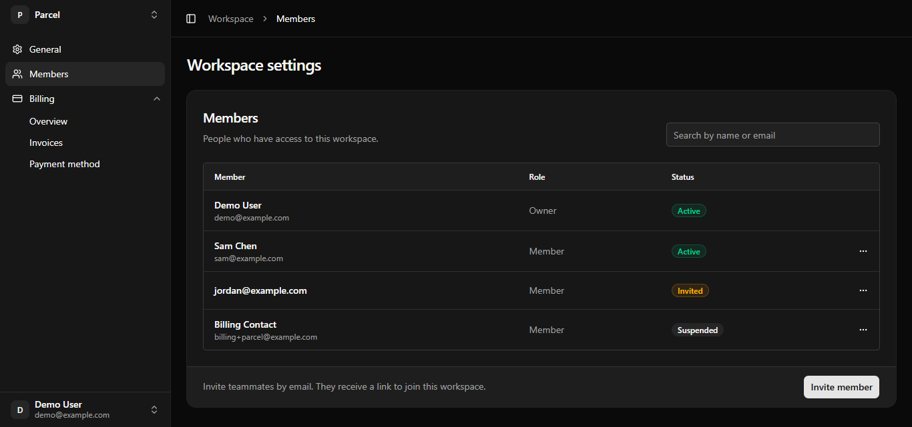
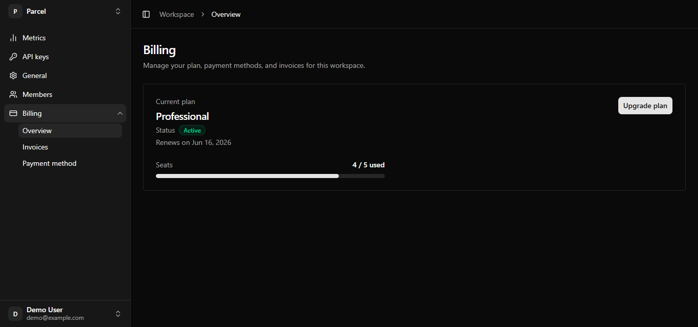
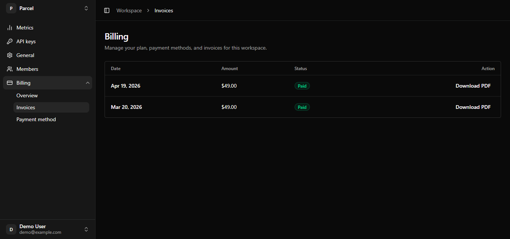
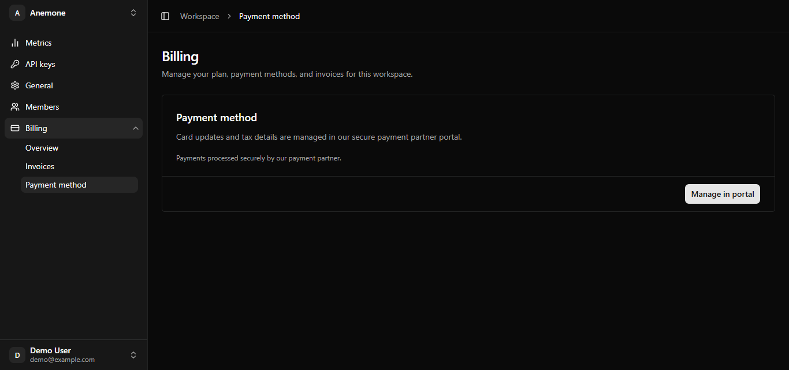
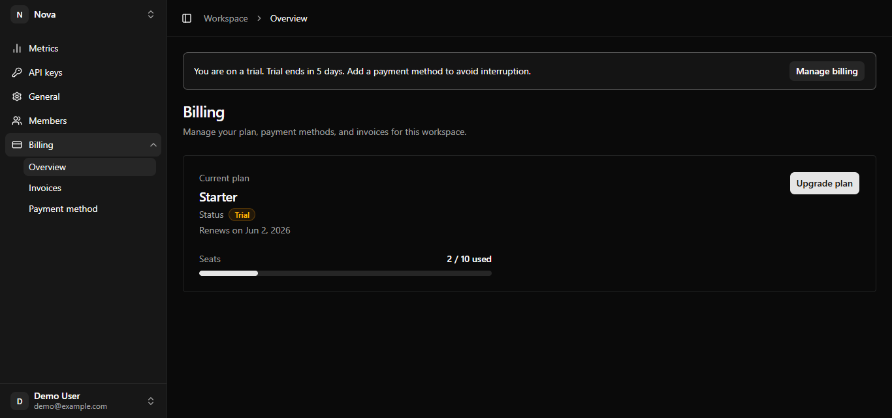

# angular-saas-starter-ui

Angular B2B SaaS shell — layout, org settings, auth UI. **You bring the API.**

Standalone UI monorepo (Spartan + Tailwind v4). Implement `@oequ/ports` against your API. For Supabase, RLS, and tenant isolation at the database layer, see the full-stack starter: [oequ/saas-starter](https://github.com/oequ/saas-starter).

**Current UI release:** `v0.4.0-ui` — workspace metrics, API keys, list-style members, outline settings cards, activation onboarding.

## Stack

- Angular 21 · Nx 22
- [Spartan UI](https://spartan.ng) (`@spartan-ng/brain`, helm in `libs/ui`)
- Tailwind CSS v4 · Chart.js (metrics demo)

## Quick start

```bash
npm install
npx nx serve demo
```

Open http://localhost:4200

## Live demo (GitHub Pages)

After enabling **Pages → Source: GitHub Actions** in the repo settings:

**https://oequ.github.io/angular-saas-starter-ui/**

## Preview

Screenshots live in [`docs/assets/`](./docs/assets/). Regenerate with `UPDATE_SCREENSHOTS=1 npm run screenshots` or drop in your own PNGs (see [docs/assets/README.md](./docs/assets/README.md)).

### Workspace activation (onboarding)

Pluggable activation checklist after workspace creation (demo: send first email). `/workspace` redirects here while activation is pending; settings deep links still work.


### Metrics

Email delivery dashboard: KPI row, period filter, Chart.js charts (mock `MetricsPort`).


### API keys

List page with search, permission filter, empty state, and create/revoke dialogs (mock `ApiKeysPort`).


### Members

Same list pattern as API keys: search, role filter, seats hint, invite flow. **Nova** has spare seats; **Parcel** is at capacity.




### Workspace settings (General)

Outline card sections (Resend-style border, no fill) for form settings.


### Billing (Overview, invoices, payment, trial)

Collapsible **Billing** in the workspace sidebar: Overview · Invoices · Payment method. Mock orgs:

| Workspace | Billing state | Demo purpose |
|-----------|---------------|--------------|
| **Parcel** | Active, 5/5 seats | Seat meter + invite blocked on Members |
| **Nova** | Trialing | Shell trial banner + mock upgrade funnel |









## Monorepo layout

```text
apps/demo              # Runnable demo (mock adapters)
apps/demo-e2e          # Playwright E2E + README screenshots
libs/ports             # AuthPort, OrgPort, BillingPort, ApiKeysPort, MetricsPort
libs/shell             # App layout (sidebar, header, billing banner)
libs/features-org      # Workspace pages (metrics, api-keys, settings, onboarding)
libs/ui                # Spartan helm components (@spartan-ng/helm/*)
libs/adapters-mock     # Mock port implementations for demo
```

## Workspace activation (onboarding)

After a user creates a workspace, the demo requires a **pluggable activation** step (target action) before the workspace root (`/workspace`) opens **General** settings. Deep links such as `/workspace/settings/members` stay available while activation is pending.

| Piece | Location |
|-------|----------|
| `ActivationPort` | `libs/ports` — `getStatus` / `markComplete` per organization |
| UI token & types | `libs/ports` — `ACTIVATION_ONBOARDING_CONFIG`, step `kind` (`prerequisite` \| `complete`) |
| Demo copy & steps | `apps/demo/src/app/demo-activation.config.ts` |
| Onboarding UI | `libs/features-org` — timeline + checklist components |
| Mock persistence | `libs/adapters-mock` — `localStorage` keys `oequ:activation:{orgId}` |

Replace the port in your app providers and supply your own `ACTIVATION_ONBOARDING_CONFIG` (title, timeline steps, explore cards). The demo UI follows the Resend onboarding reference in [oequ/saas-starter — `design/reference/resend`](https://github.com/oequ/saas-starter/tree/main/design/reference/resend).

## Quality

This project follows the open **[Quality Framework](https://github.com/oequ/quality-framework)** (rubric + maturity levels for Angular B2B SaaS).

- Self-assessment: [docs/QUALITY.md](./docs/QUALITY.md)
- Rubric v1.0: [docs/rubric](https://github.com/oequ/quality-framework/tree/main/docs/rubric)

## Scripts

| Command | Description |
|---------|-------------|
| `npx nx serve demo` | Dev server |
| `npx nx build demo` | Production build |
| `npm run e2e` | Playwright E2E |
| `UPDATE_SCREENSHOTS=1 npm run screenshots` | Regenerate `docs/assets/*.png` for README |
| `npx nx run-many -t lint --all` | Lint all projects |
| `npx nx run-many -t test --all` | Unit tests |

## License

MIT — see [LICENSE](./LICENSE).
