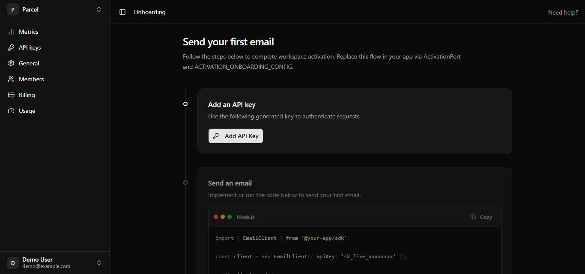
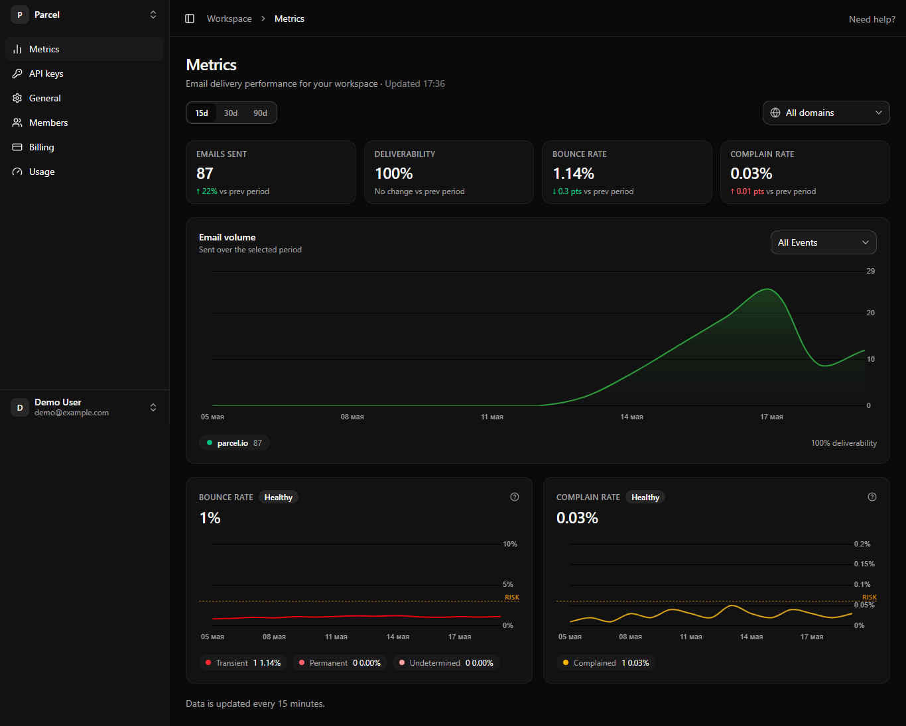
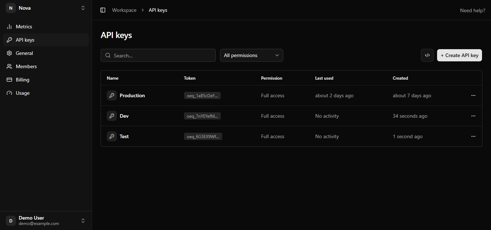
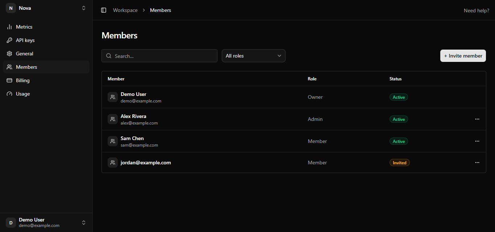
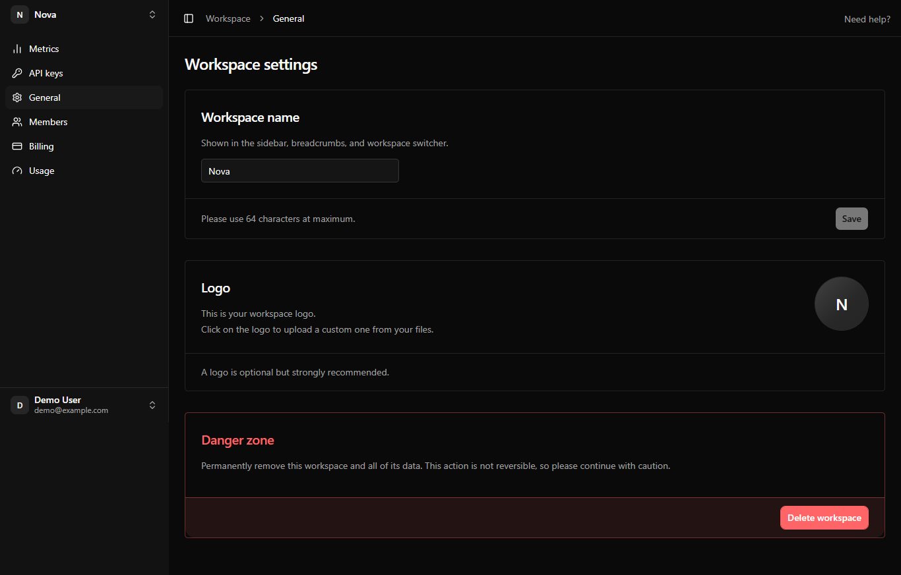
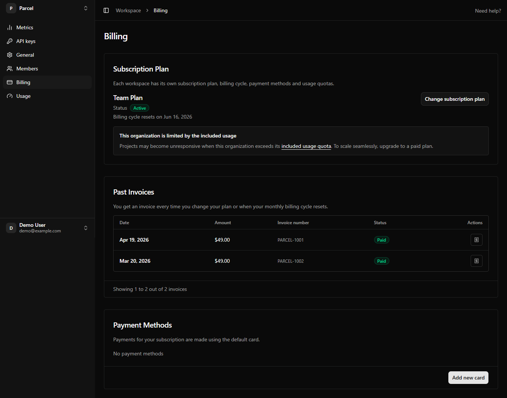
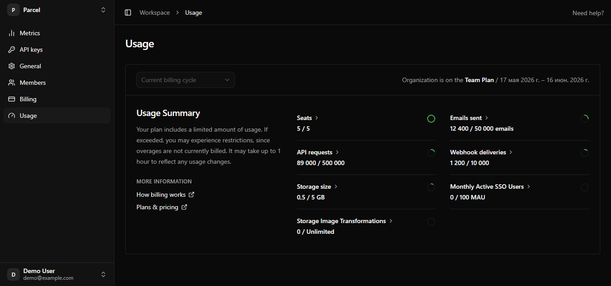
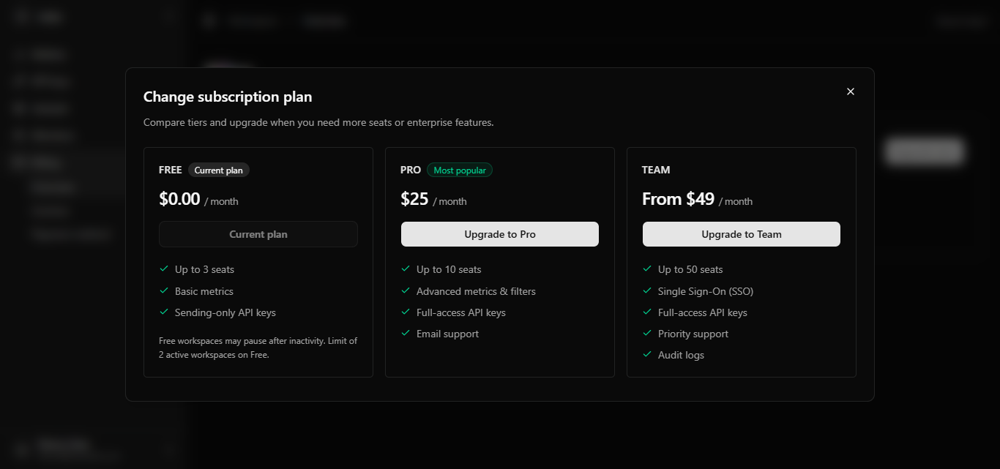
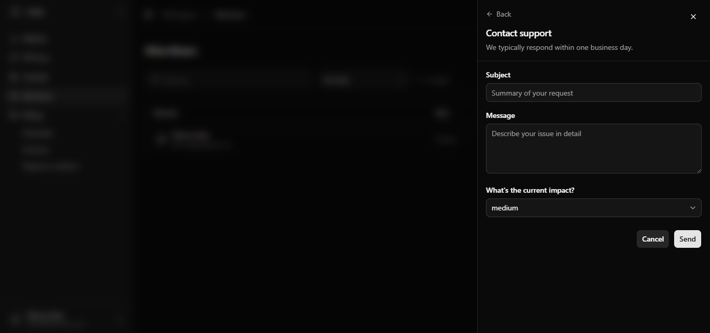

# angular-saas-starter-ui

Angular B2B SaaS shell — layout, org settings, auth UI. **You bring the API.**

Standalone UI monorepo (Spartan + Tailwind v4). Implement `@oequ/ports` against your API. For Supabase, RLS, and tenant isolation at the database layer, see the full-stack starter: [oequ/saas-starter](https://github.com/oequ/saas-starter).

**Current UI release:** `v0.4.0-ui` — metrics, API keys, list-style members, outline settings, activation onboarding, in-app payment methods, stacked paywall checkout/downgrade dialogs.

## Stack

- Angular 21 · Nx 22
- [Spartan UI](https://spartan.ng) (`@spartan-ng/brain`, helm in `libs/ui`)
- Tailwind CSS v4 · Chart.js (metrics demo)

## Quick start

```bash
npm install
npx nx serve demo
```

Open http://localhost:4200

**Demo sign-in (mock adapters only):** `demo@example.com` / `OequDemo2026!` — pre-filled on the login form; constants in `@oequ/ports` (`DEMO_AUTH_EMAIL`, `DEMO_AUTH_PASSWORD`).

## Live demo (GitHub Pages)

After enabling **Pages → Source: GitHub Actions** in the repo settings:

**https://oequ.github.io/angular-saas-starter-ui/**

### PWA (demo app)

The **demo** ships as an installable PWA for GitHub Pages and production builds — not enabled during `nx serve` (dev mode).

| Piece | Location |
|-------|----------|
| Web app manifest | `apps/demo/public/manifest.webmanifest` |
| Service worker | `@angular/service-worker` — `apps/demo/ngsw-config.json`, registered in `app.config.ts` when `!isDevMode()` |
| Icons | `apps/demo/public/icons/` — [Lucide](https://lucide.dev/icons/layers) **layers** (ISC) |

**Install (Android Chrome):** open the HTTPS demo URL → browser menu → **Install app** / **Add to Home screen**.

**Build with SW:** `npx nx build demo` or `npm run build:pages` (GitHub Pages base href). Serve `dist/apps/demo/browser` over HTTPS to test install locally.

**Regenerate icons:** `node apps/demo/scripts/generate-pwa-icons.mjs` (devDependency `@resvg/resvg-js`). Your product fork should replace manifest name, theme colors, and icons.

## Preview

Screenshots live in [`docs/assets/`](./docs/assets/). Regenerate with `UPDATE_SCREENSHOTS=1 npm run screenshots` or drop in your own PNGs (see [docs/assets/README.md](./docs/assets/README.md)).

### Workspace activation (onboarding)

Pluggable activation checklist after workspace creation (demo: send first email). `/workspace` redirects here while activation is pending; settings deep links still work.



### Metrics

Email delivery dashboard: KPI row, period filter, Chart.js charts (mock `MetricsPort`).



### API keys

List page with search, permission filter, empty state, and create/revoke dialogs (mock `ApiKeysPort`).



### Members

Same list pattern as API keys: search, role filter, seats hint, invite flow.



### Workspace settings (General)

Outline card sections (Resend-style border, no fill): rename workspace, upload/remove workspace icon, danger zone. Saves use Sonner toasts (no full-page reload).



### Billing

Single scroll page: **Subscription Plan** · **Past Invoices** · **Payment Methods** (outline cards, same pattern as General settings).

**Payment methods (mock):** list saved cards, **Add payment method** dialog, **Make default** / **Remove**. Demo accepts Stripe test numbers `4242 4242 4242 4242` or `5555 5555 5555 4444`. Production path: `BillingPort.addPaymentMethod` → Stripe Setup Intent + Elements (portal optional for tax/address).

| Workspace | Billing state | Demo purpose |
|-----------|---------------|--------------|
| **Parcel** | Active Team, 4/50 seats; Visa •••• 4242 on file | Invoices + payment methods seeded |
| **Lumen** | Free, 4/3 seats; no cards | Add-card flow; seat limit on Members |
| **Nova** | Trialing Pro; Mastercard •••• 4444 on file | Trial banner + upgrade funnel |



### Usage

Supabase-style quota page: billing cycle, plan limits, circular progress rings, tooltips on metrics, **Upgrade** for Team-only features. Linked from Billing via *included usage quota*.



### Paywall (plan picker)

Wide plan picker (**Free · Pro · Team**) from **Change subscription plan** on Billing. **Upgrade** opens a stacked checkout dialog; **downgrade** opens a stacked confirm dialog (paywall stays full width underneath). Mock upgrade uses simulated checkout; downgrade applies immediately with seat-limit checks — no Stripe in the UI repo.



### Cookie consent

GDPR-style first-layer banner on all routes: **Reject all** and **Accept all** with equal prominence, plus **Manage preferences** (categories off by default). Consent stored in `localStorage`; reopen via **Cookie preferences** in the user menu. See `/auth/cookies`.


### Help panel

Context-aware help sheet in the shell header (**Need help?** or `?`). Route-specific topics, browse section, system status, and contact support form.



## Monorepo layout

```text
apps/demo              # Runnable demo (mock adapters)
apps/demo-e2e          # Playwright E2E + README screenshots
libs/ports             # AuthPort, OrgPort, BillingPort, ApiKeysPort, MetricsPort
libs/shell             # App layout (sidebar, header, billing banner, help panel, paywall)
libs/features-org      # Workspace pages (metrics, api-keys, settings, onboarding)
libs/ui                # Spartan helm components (@spartan-ng/helm/*)
libs/adapters-mock     # Mock port implementations for demo
```

## Workspace activation (onboarding)

After a user creates a workspace, the demo requires a **pluggable activation** step (target action) before the workspace root (`/workspace`) opens **General** settings. Deep links such as `/workspace/settings/members` stay available while activation is pending.

| Piece | Location |
|-------|----------|
| `ActivationPort` | `libs/ports` — `getStatus` / `markComplete` per organization |
| UI token & types | `libs/ports` — `ACTIVATION_ONBOARDING_CONFIG`, step `kind` (`prerequisite` \| `complete`) |
| Demo copy & steps | `apps/demo/src/app/demo-activation.config.ts` |
| Onboarding UI | `libs/features-org` — timeline + checklist components |
| Mock persistence | `libs/adapters-mock` — `localStorage` keys `oequ:activation:{orgId}` |

Replace the port in your app providers and supply your own `ACTIVATION_ONBOARDING_CONFIG` (title, timeline steps, explore cards). The demo UI follows the Resend onboarding reference in [oequ/saas-starter — `design/reference/resend`](https://github.com/oequ/saas-starter/tree/main/design/reference/resend).

## Quality

This project follows the open **[Quality Framework](https://github.com/oequ/quality-framework)** (rubric + maturity levels for Angular B2B SaaS).

- Self-assessment: [docs/QUALITY.md](./docs/QUALITY.md)
- Rubric v1.0: [docs/rubric](https://github.com/oequ/quality-framework/tree/main/docs/rubric)

## Scripts

| Command | Description |
|---------|-------------|
| `npx nx serve demo` | Dev server |
| `npx nx build demo` | Production build (includes service worker) |
| `npm run build:pages` | GitHub Pages build (`baseHref` + PWA) |
| `npm run e2e` | Playwright E2E |
| `UPDATE_SCREENSHOTS=1 npm run screenshots` | Regenerate `docs/assets/*.png` for README |
| `npx nx run-many -t lint --all` | Lint all projects |
| `npx nx run-many -t test --all` | Unit tests |

## License

MIT — see [LICENSE](./LICENSE).
