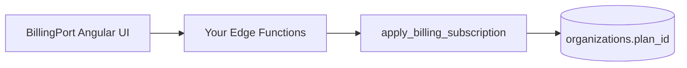

# Custom billing provider (`apps/web`)

How to connect a non-Stripe payment backend (YooKassa, CloudPayments, invoice billing, etc.) while keeping the starter UI.

**Architecture:** [ADR 0002 — Multi-provider billing](./adr/0002-billing-multi-provider.md)

## Mental model



- **UI** never imports provider SDKs.
- **Postgres** owns `plan_id` / `seats_limit`.
- **Your code** only implements payment + webhooks, then calls shared RPCs.

## 1. Choose a provider id

Short lowercase slug, unique per deployment, e.g. `yookassa`, `cloudpayments`, `invoice`.

Stored in `organization_billing.provider` and `billing_events.provider`.

## 2. Configure the app

[`apps/web/src/app/supabase.settings.ts`](../apps/web/src/app/supabase.settings.ts) (generated locally):

```ts
export const webSupabaseSettings = {
  url: '...',
  anonKey: '...',
  billingProvider: 'custom', // or 'mock' if you only sync via webhooks
  // stripeEnabled is deprecated; use billingProvider: 'stripe' for Stripe
};
```

Environment (optional):

```bash
BILLING_PROVIDER=custom   # used by scripts/write-web-supabase-settings.mjs
```

With `custom`, checkout/portal still use **mock** flows until you add your own Edge Functions and point UI invoke names in a fork. Plan changes from webhooks still apply via Postgres.

## 3. Webhook (required)

Copy the example:

`supabase/functions/billing-custom-webhook.example/` → `supabase/functions/billing-custom-webhook/`

Register in `supabase/config.toml` and deploy.

Shared helpers: [`supabase/functions/_shared/billing-rpc.ts`](../supabase/functions/_shared/billing-rpc.ts)

```ts
import {
  applyBillingSubscription,
  recordBillingEvent,
  deleteBillingEvent,
} from '../_shared/billing-rpc.ts';

const PROVIDER = 'yookassa';

// 1. Verify provider signature (your logic)
// 2. Idempotency
const status = await recordBillingEvent(admin, PROVIDER, eventId, eventType);
if (status === 'duplicate') return ok();

try {
  // 3. Normalize to internal plan
  await applyBillingSubscription(admin, {
    organizationId: '...',      // from metadata you set at checkout
    planId: 'pro',              // free | pro | team
    provider: PROVIDER,
    externalCustomerId: '...',
    externalSubscriptionId: '...',
    subscriptionStatus: 'active', // active | canceled | past_due | none | ...
    currentPeriodEnd: '2026-06-01T00:00:00Z',
    cancelAtPeriodEnd: false,
  });
} catch (e) {
  await deleteBillingEvent(admin, PROVIDER, eventId);
  throw e;
}
```

### Subscription status values

Aligned with Stripe-ish states consumed by UI: `active`, `trialing`, `past_due`, `canceled`, `unpaid`, `incomplete`, `paused`, `none`.

Canceled / expired → set `planId: 'free'` (same as Stripe webhook handler).

## 4. Checkout (optional)

Stripe uses `billing-create-checkout`. For custom providers:

1. Create `billing-create-checkout-yookassa` (your name).
2. Create payment in provider API; store `organization_id` in metadata.
3. On success URL or webhook, call `apply_billing_subscription`.

Link customer before subscription:

```sql
select link_organization_billing_provider(
  p_organization_id := '...',
  p_provider := 'yookassa',
  p_external_customer_id := '...',
  p_external_subscription_id := null,
  p_subscription_status := 'none'
);
```

(Service role via `admin.rpc(...)` from Edge Functions.)

## 5. What you do not need to change

| Layer | Action |
|-------|--------|
| `libs/features-org` billing/paywall components | None |
| `BillingPort` interface | None (unless adding capabilities) |
| Seat limits / RLS | None — driven by `plan_id` |
| `e2e:web:release` | Keep `billingProvider: 'mock'` |

## 6. Russia / no Stripe

Recommended production setup:

| Setting | Value |
|---------|--------|
| `billingProvider` | `custom` or `mock` |
| Stripe Edge Functions | Not deployed / secrets unset |
| Plan upgrades | Your webhook → `apply_billing_subscription` |
| Local dev | `mock` + `update_organization_plan` (same as today) |

## 7. Stripe reference

If you also ship Stripe in other regions, see [STRIPE_LOCAL.md](./STRIPE_LOCAL.md). Stripe uses `provider = 'stripe'` and the same `organization_billing` table.

## Checklist

- [ ] Provider id chosen
- [ ] Webhook Edge Function + signature verification
- [ ] `recordBillingEvent` for idempotency
- [ ] `apply_billing_subscription` on paid / canceled events
- [ ] `billingProvider` in web settings
- [ ] Secrets in Supabase project (not committed)
- [ ] Manual smoke: upgrade plan → UI shows new plan + seat limit
